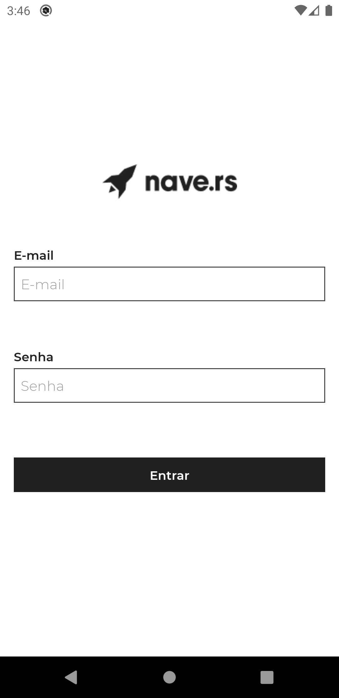
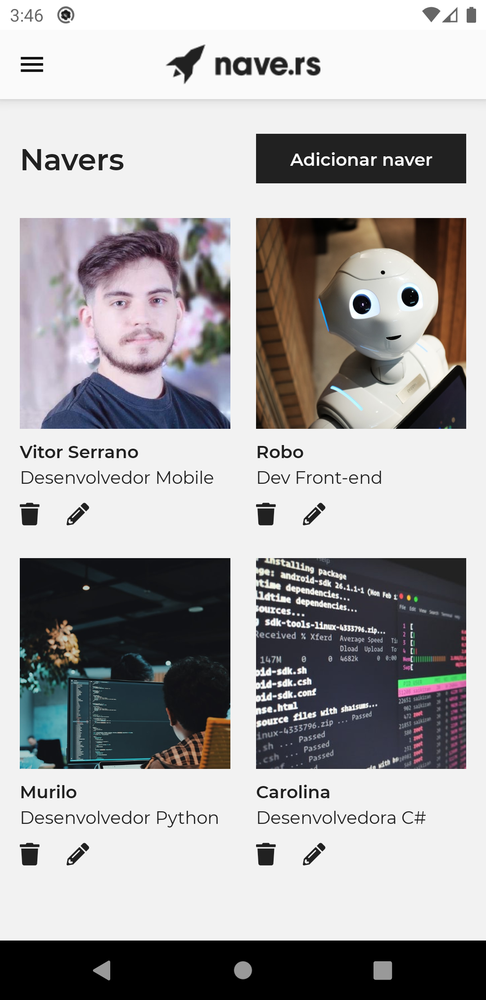
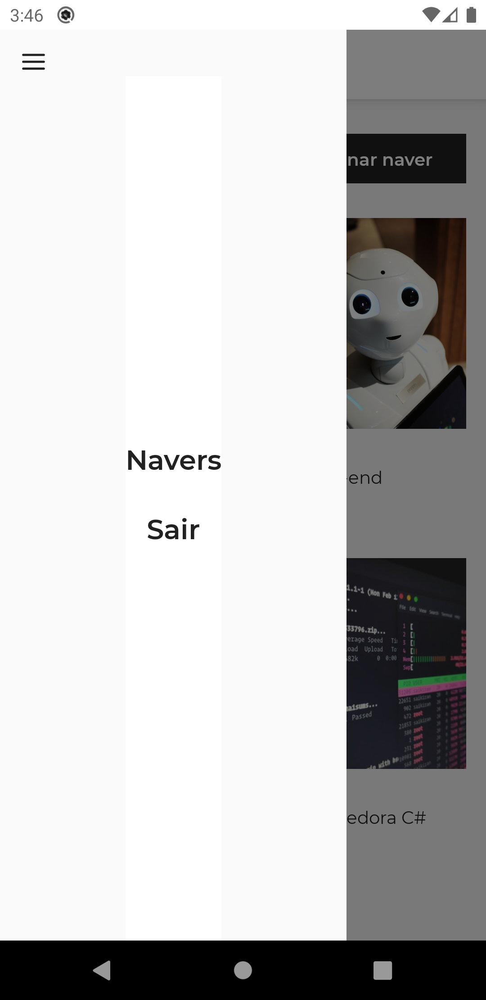
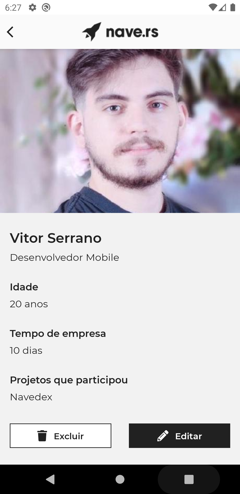
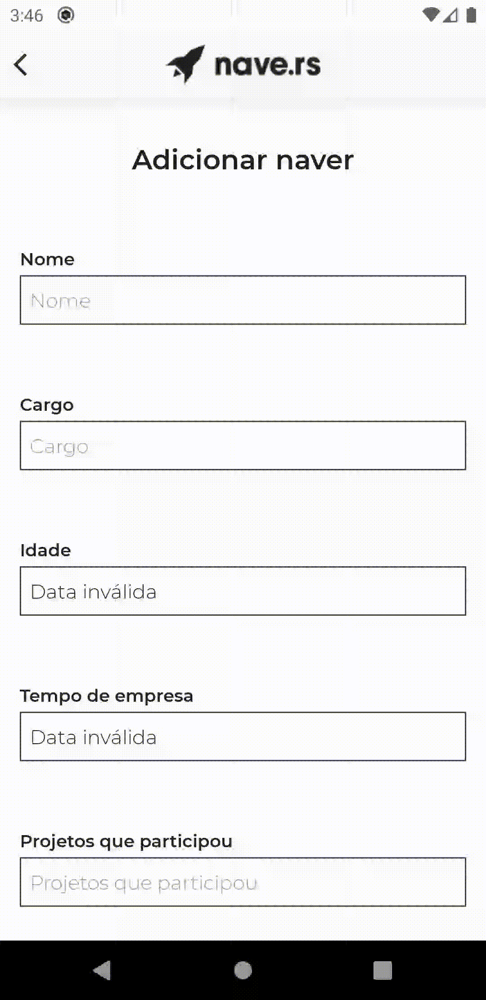
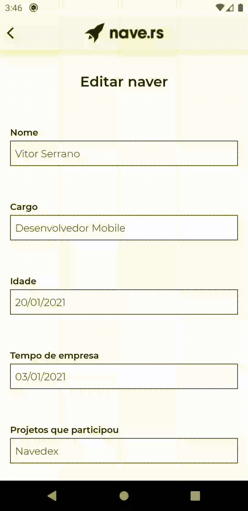
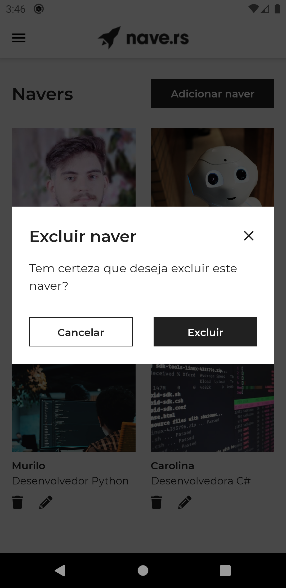
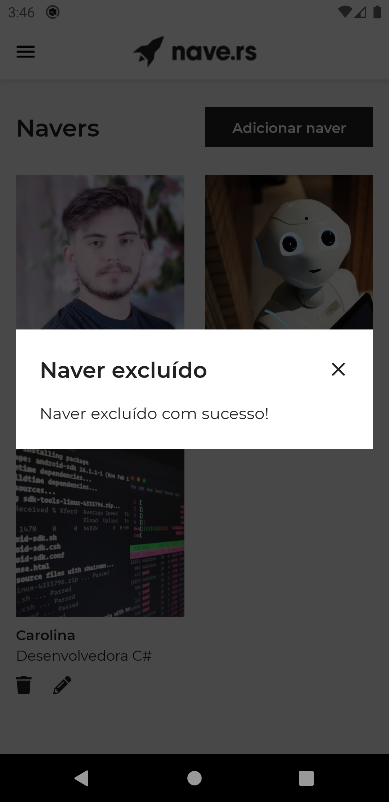
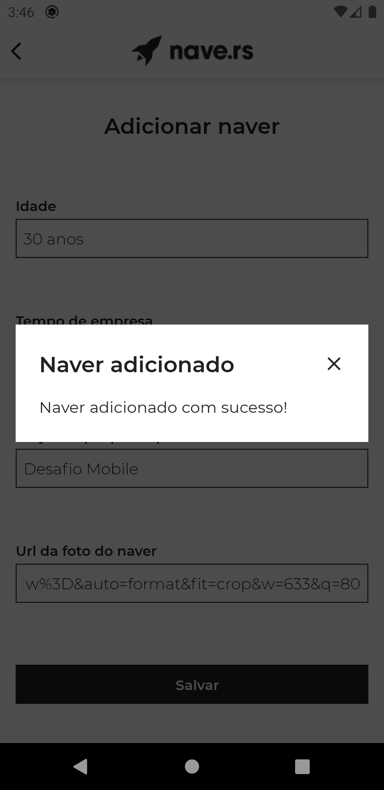
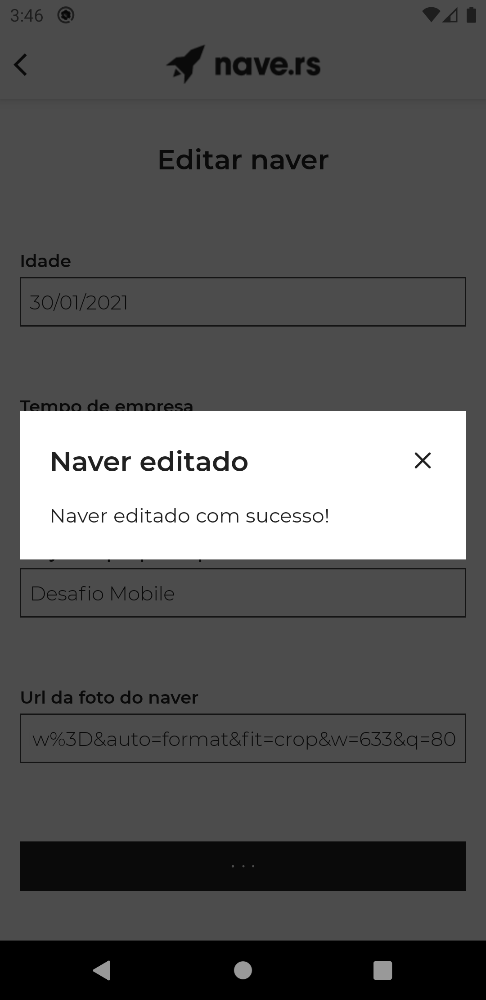

<h4 align="center">
    
</h4>

## Índice

- [Sobre](#sobre)
- [Tecnologias Utilizadas](#tecnologias-utilizadas)
- [Layout](#layout)
- [Funcionalidades](#funcionalidades)
- [Resultado](#resultado)
- [Pré-requisitos](#pre-requisitos)
- [Como Usar](#como-usar)
- [Observaões](#observacoes)

## :bookmark: Sobre

Este repositório é o resultado para o **desafio de recrutamento mobile** da [Nave.rs](https://github.com/Naveteam)

## :rocket: Tecnologias Utilizadas

Esse projeto foi desenvolvido com as seguintes tecnologias:

- [Typescript](https://www.typescriptlang.org/)
- [React Native](https://reactnative.dev/)
- [React Navigation](https://reactnavigation.org/)
- [Styled Components](https://styled-components.com/)
- [Axios](https://github.com/axios/axios)
- [Formik](https://formik.org/)
- [Yup](https://www.npmjs.com/package/yup)

## 💅 Layout

O layout proposto para o desafio está disponível no [Figma](https://www.figma.com/file/MIh7DeADz8M3mmcQwpcFdD/Teste-Mobile?node-id=1253%3A0)

## 🗂️ Funcionalidades

- [x] Fluxo de autenticação (Login/Logout)
- [x] Listagem de Navers
- [x] Criação de um Naver
- [x] Visualização de um Naver
- [x] Edição de um Naver
- [x] Remoção de um Naver

## 📷 Screens

<h1 align="center">
  
  
  
  
  
  
  
  
  
  
</h1>

## :fire: Pré-requisitos

Para rodar este projeto é necessário ter instalado na sua máquina as seguntes tecnologias:

- [Node.js](https://nodejs.org/en/)
- [Yarn](https://yarnpkg.com/)

## :zap: Como usar

1. Faça um clone desse repositório: `git clone https://github.com/vitorserrano/naveteam-mobile-challange.git`
2. Instale as dependências: `yarn`
3. Startar a aplicação: `yarn start`
4. Rode o aplicativo: `yarn android`

## 📝 Observações

- Foi utilizado `Context` para fazer o fluxo de **autenticação do aplicativo**. Por conta disso, há algumas ações como:
  - Ao fazer o login no app, o usuário ficará logado até fazer o logout, mesmo reiniciando o mesmo. Isso foi feito para simular um fluxo de app real.
  - Levando isso em consideração, também adicionei uma configuração para que após o usuário logar, o token seja definido no header de todas as requisições do app.
- Foi adicionado Scroll para as telas de Detalhes e de Create/Update de um Naver para seguir fielmente o layout proposto.

<h4 align="center">
    Feito com 💜 by <a href="https://www.linkedin.com/in/vitor-serrano/" target="_blank">Vitor Serrano</a>
</h4>
